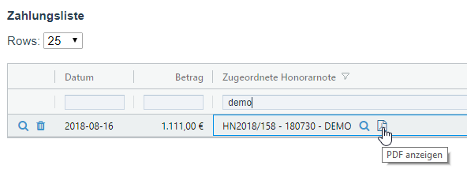

# Example usage

```js
col = grid.getColDef('rockpayment_invoice:title');
col.headerName = 'Zugeordnete Honorarnote';
col = rgColAddIcons(col, [{
  icon: 'search',
  cls: 'pw-panel',
  dataHref: '/admin/page/edit/?id={rockpayment_invoice}',
  show: 'hover',
  label: 'anzeigen',
},{
  icon: 'file-pdf-o',
  cls: 'pw-panel',
  dataHref: '/site/assets/files/{rockpayment_invoice}/{rockpayment_invoice:rockinvoice_pdf}',
  show: 'hover',
  label: 'PDF anzeigen',
}]);
```


