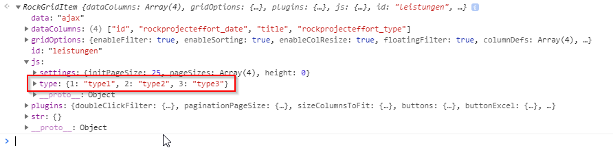

# Docs

## Add global RockGrid settings (colors, styles, values)

```js
// /site/assets/RockGrid/fields/global.js
document.addEventListener('RockGridReady', function(e) {
  RockGrid.settings = {
    foo: 'bar',
  };
});
```

## Disable floating filter

```js
document.addEventListener('RockGridItemBeforeInit', function(e) {
  if(e.target.id != 'RockGridItem_yourgridid') return;
  var grid = RockGrid.getGrid(e.target.id);
  grid.gridOptions.floatingFilter = false;
});
```

## Example how to trigger refresh after panel was closed

```js
// /site/assets/RockGrid/fields/global.js
$(document).on('pw-panel-closed', function(event, $panel) {
  console.log(event);
  console.log($panel);
  $.each($('.RockGridItem:visible'), function(i, $el) {
    $wrapper = $(RockGrid.getGrid($el).getWrapperDOM());
    $wrapper.find('.rockgridbutton.refresh').click();
  });
});
```

## Example of a RockGrid in a ProcessModule

```php
$form = $this->modules->get('InputfieldForm');

$f = $this->modules->get('InputfieldRockGrid');
$f->name = 'myRockGridField';
$f->themeBorder = 'none';
$f->height = 0;
$f->pageSize = 1; // set initial pagination to 25 rows
$f->setData(new RockFinder("id>0, limit=10", [
  'title',
  'templates_id',
  'created',
  'status',
]));
$form->add($f);

return $form->render();
```
Then you can modify your grid via a javascript file: `/site/assets/RockGrid/fields/myRockGridField.js`

---

## Example of a multilanguage setup:

You can define language strings either locally for a grid in `/site/assets/RockGrid/fields/yourfield.php`:

```php
$this->x('pl_name', __('Projektleiter'));
$this->x('title', __('Bezeichnung'));
```

Access these strings in the grid's js file:

```js
var grid = RockGrid.getGrid('yourgridname');
console.log(grid.str.pl_name);
console.log(grid.str.title);
```

Or you can define global strings in any globally loaded file, but recommended in `site/assets/RockGrid/lang.php` (note I'm using `->rg->x` instead of `->x`):

```php
$this->rg->x('pl_name', __('Projektleiter'));
$this->rg->x('title', __('Bezeichnung'));
```

Access these strings in the grid's js file:

```js
console.log(RockGrid.str.pl_name);
console.log(RockGrid.str.title);
```

## Transmit data to the client-side

Select-Option fields by default show the ID of the field and not the label. In this case it might be the easiest
solution to send an array to JavaScript with a reference list of which ID has which label:

```php
// site/assets/RockGrid/fields/yourfield.php
$this->js([
  'type' => [
    1 => 'type1',
    2 => 'type2',
    3 => 'type3'
  ]
]);
```

There is also a shortcut for options fields:

```php
// site/assets/RockGrid/fields/yourfield.php
$this->js('RockGrid', [
  'efforttype' => $this->getOptionsFromField('efforttype'),
  'projectstatus' => $this->getOptionsFromField('projectstatus'),
]);
```

Then the data is available in your griditem object:



You can then create a cellRenderer or a valueGetter to replace the field IDs by labels:

```js
col = grid.getColDef('rockprojecteffort_type');
col.headerName = 'Typ';
col.cellRenderer = function(params) {
  // get the current cell value
  var val = params.data.rockprojecteffort_type;
  // return the corresponding label
  return grid.js.type[val];
};
```

Notice that you have a helper method to get all options of an options field:

```php
$this->js([
  'type' => $this->getOptionsFromField('rockprojecteffort_type'),
]);
```

## Add payload to AJAX-Requests

When having an AJAX powered grid it is sometimes necessary to pass variables to the server. For example
you could have a process module showing a grid that should only list projects of one specific year.

```js

document.addEventListener('RockGridItemBeforeInit', function(e) {
  if(e.target.id != 'RockGridItem_yourgridid') return;
  var grid = RockGrid.getGrid(e.target.id);

  // get payload for ajax requests
  grid.getPayload = function() {
    return {
      year: grid.js.year,
      randomDemo: function() {
        return Math.random();
      }
    }
  }
});
```

The resulting request url could look something like that:

```
?field=auftragsbuch&RockGrid=1&year=2019&randomDemo=0.9468739776294344
```

This way you can pass any variables to the data-requesting AJAX call, for example a filter value, a selectbox
value etc.

In your php file you can access the variable like this:

```php
$year = wire()->input->get->year ?: date('Y');
$selector = "template=project,year=$year";
$finder = new RockFinder($selector, [...]);
```

## Set visible columns
```js
document.addEventListener('RockGridItemAfterInit', function(e) {
  if(e.target.id != 'RockGridItem_architecture') return;
  var grid = RockGrid.getGrid(e.target.id);

  grid.setColumns(['id', 'fbdone', 'answers', 'fgcount', 'fg:title', 'fncount', 'fn:title', 'fbrole:title']);
});
```

```js

document.addEventListener('RockGridItemAfterInit', function(e) {
  if(e.target.id != 'RockGridItem_mygridid') return;
  var grid = RockGrid.getGrid(e.target.id);
  
  // hide one column
  grid.columnApi().setColumnVisible('myhiddencolumn', false);
});
```

## Manual initialisation / JavaScript-only Grids

Sometimes you might need JavaScript-only grids. For example you could create a grid
that shows aggregated data of another grid. The simplest example of such a grid is
taken from [the ag-grid getting started guide](https://www.ag-grid.com/javascript-getting-started/).

```js
document.addEventListener('RockGridItemBeforeInit', function(e) {
  if(e.target.id != 'RockGridItem_yourgridid') return;
  var grid = RockGrid.getGrid(e.target.id);
  var gridOptions = grid.gridOptions;

  gridOptions.columnDefs = [
    {headerName: "Make", field: "make"},
    {headerName: "Model", field: "model"},
    {headerName: "Price", field: "price"}
  ];

  gridOptions.rowData = [
    {make: "Toyota", model: "Celica", price: 35000},
    {make: "Ford", model: "Mondeo", price: 32000},
    {make: "Porsche", model: "Boxter", price: 72000}
  ];
});
```

To update this grid whenever the master grid is changed use something like this:

```js
document.addEventListener('RockGridItemBeforeInit', function(e) {
  if(e.target.id != 'RockGridItem_slave') return;
  var grid = RockGrid.getGrid(e.target.id);
  var gridOptions = grid.gridOptions;

  gridOptions.columnDefs = [
    {headerName: "Make", field: "make"},
    {headerName: "Model", field: "model"},
    {headerName: "Price", field: "price"}
  ];

  /**
   * create custom redraw function for this grid
   */
  grid.redraw = function() {
    var master = RockGrid.getGrid('master');

    // get filtered id's of master grid
    // see pluck() function in RockGridItem.js
    var ids = master.pluck('id', {filter:true, sort:false});
    console.log(ids);

    // setup data array
    var data = [];
    for(var i = 0; i<ids.length; i++) {
      data.push({
        make: 'Row ' + i,
        model: ids[i],
        price: Math.random(),
      });
    }

    // set new data
    grid.api().setRowData(data);
  }
});

/**
 * attach event listeners to master table
 */
document.addEventListener('RockGridItemAfterInit', function(e) {
  if(e.target.id != 'RockGridItem_master') return;
  var grid = RockGrid.getGrid(e.target.id);

  var redraw = function(e) { RockGrid.getGrid('slave').redraw(); }
  grid.gridOptions.api.addEventListener('rowDataChanged', redraw);
  grid.gridOptions.api.addEventListener('filterChanged', redraw);
});
```

## Add dynamic columns

```js
document.addEventListener('RockGridItemBeforeInit', function(e) {
  if(e.target.id != 'RockGridItem_mygridid') return;
  var grid = RockGrid.getGrid(e.target.id);
  
  // add reports column
  grid.gridOptions.columnDefs.push({
    valueGetter: function() { return 'x'; },
  });
});
```

## Listening for events

See https://www.ag-grid.com/javascript-grid-reference-overview/#listening-to-events for more information and https://www.ag-grid.com/javascript-grid-events/ for all available events.

Example:

```js
document.addEventListener('RockGridItemAfterInit', function(e) {
  if(e.target.id != 'RockGridItem_projects') return;
  var grid = RockGrid.getGrid(e.target.id);
  
  grid.api().addEventListener('rowSelected', function(e) {
    console.log('row was (un)selected!');

    // show array of selected ids
    console.log(grid.pluck('id', {selected:true}));
  })
});
```

## AJAX callbacks, Batcher Plugin

In your php data-file:

```php
$this->ajax('send', function($data) {
  foreach($data as $item) {
    // do something
  }
});
```

You can also set options on the server-side so you do not need to put sensitive data in the AJAX request:

```php
$this->ajax('send', function($data, $options) {
  $project = $options['projectid'];
  foreach($data as $person) {
    // do something
  }
}, ['projectid' => $project]);
```

Setup the GUI on the client-side:

```js
$(document).on('click', 'button[name=send]', function() {
  var grid = RockGrid.getGrid('recipients');

  // get recipients type
  var mails = $('input[name=mails]:checked', '#sendmailform').val();
  var recipient = $('input[name=recipient]:checked', '#sendmailform').val();
    
  // show confirm dialog
  var Batcher = RockGrid.batcher;
  Batcher.items = grid.pluck('id', {selected: (mails=='selected')});
  Batcher.batchSize = 10;
  Batcher.action = function(items) {
    // send ajax request to this grid
    var ajax = grid.ajax({
      action: 'send',
      data: items,
    }).done(function(params) {
      Batcher.nextBatch();
    });
  };
  Batcher.confirmStart({
    msg: grid.js.confirmsend,
    onYes: function() {
      Batcher.nextBatch();
    },
    onLoad: function() {
      if(!Batcher.items.length) {
        ProcessWire.alert(grid.js.noItems);
        return false;
      }
    },
  });
});
```

## Extending RockGrid and RockGridItem

You can extend RockGrid easily by placing code like this into `/site/assets/RockGrid/fields/global.js`

```js
document.addEventListener('RockGridItemReady', function(e) {
  /**
   * be careful not to get in conflict with RockGridItem's original methods
   * call it like this: grid.myCustomDemoMethod('hello world');
   */
  RockGridItem.prototype.myCustomDemoMethod = function(str) {
    console.log(this); // current RockGridItem instance
    console.log(str);
  }
});
```

## Create custom filters

See a simple example filter with lots of comments here: `/site/modules/FieldtypeRockGrid/plugins/filters/example.js`

Apply the filter like this:

```js
document.addEventListener('RockGridItemBeforeInit', function(e) {
  if(e.target.id != 'RockGridItem_yourgrid') return;
  var grid = RockGrid.getGrid(e.target.id);
  col = grid.getColDef('title');
  col.filter = RockGrid.filters.example;
  col.floatingFilterComponent = RockGrid.filters.exampleFloating;
});
```

---

# Extending Grids

Sometimes several RockGrids are very similar and you don't want to duplicate your code. You can create one base file and include this file from others:

```php
// trainings.php
$finder = new RockFinder([
  'template' => 'training',
  'sort' => 'from',
], [
  'first',
  'from',
  'to',
]);
$finder->addField('coach', ['title']);
$finder->addField('client', ['fullname']);

// trainings_booked.php
include(__DIR__.'/trainings.php');

$finder->setSelectorValue('client', $this->user); // only show trainings of current user
$finder->addField('done'); // add column to show if the training was completed

$this->setData($finder);
```

You can then create another file, for example `trainings_available.php` to show all trainings that are in the future and available for booking:

```php
include(__DIR__.'/trainings.php');

$finder->setSelectorValue('from>', time());
$finder->setSelectorValue('client', null); // client must not be set -> means available for booking

$this->setData($finder);
```


---
---
